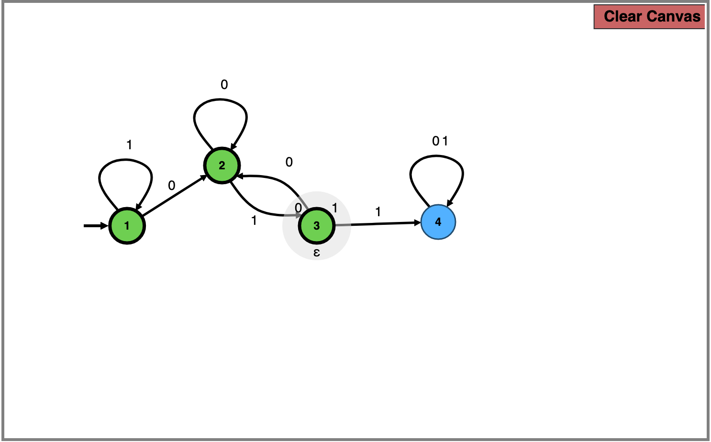

# Week 2 HW, credit tasks

### Task 1)
Using the NFA from P-2e, we perform product construction to obtain this. However the DFA was first obtained by building intuitively,

*minimal DFA of P-2e and C-2a*

The strategy here is to use the upper row of states as even parity of `0`s, the bottom row being odd parity of states. So it is easy to assign, according to condition

- All of top rows can be regarded as final states.
- The third state of bottom row (q3) is an accepting state for exactly two `1`s.

This is achieved as the number of `1`s in the sequence is the number of horizontal transitions taken from the initial state.

**Additionally**, the old DFA of previous submission can be *minimized* by subset partitioning to the same above diagram. 

### Task 2)
This DFA is very intuitive. We split initial state into case `0` and `1`. The loops formed by (2,4) and (3,5) were constructed to ensure that all incoming tranistion to the final states are the same to the corresponding starting symbol.

*DFA of same symbols*

### Task 3)
This DFA is sourced from the NFA constructed for P-2f, by inverting the accepting and non-accepting states from a DFA that only accepts substring `011`.

*inverted DFA of substring `011`*

### Task 4)
The NFA is constructed the same as that of the DFA of Task 2

*DFA of same symbols*
