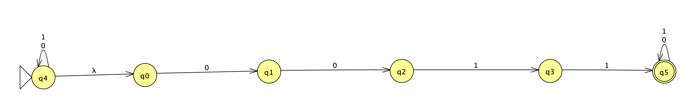
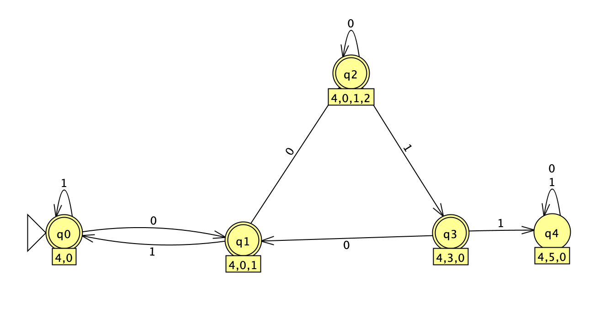
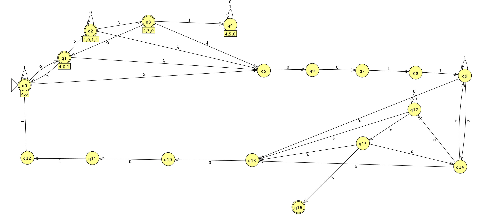
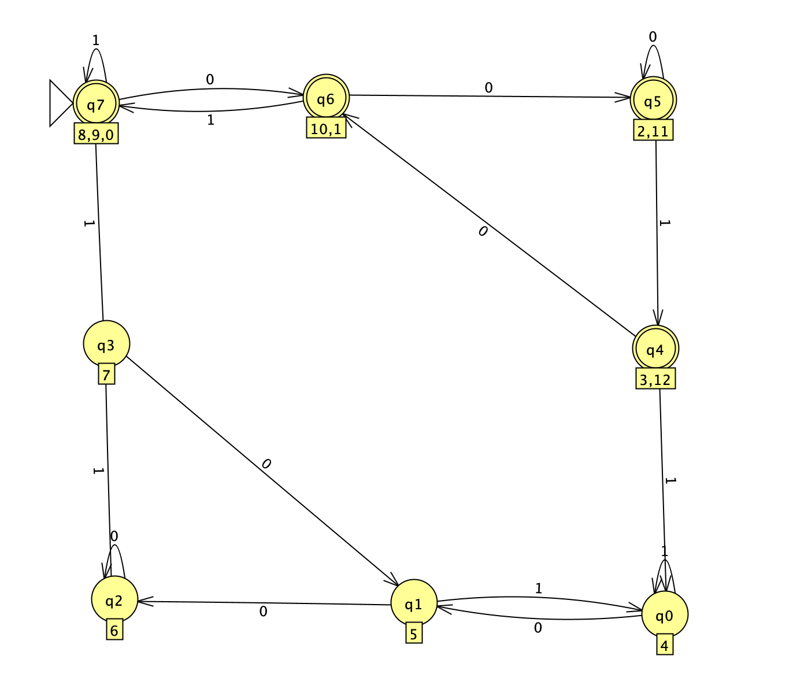
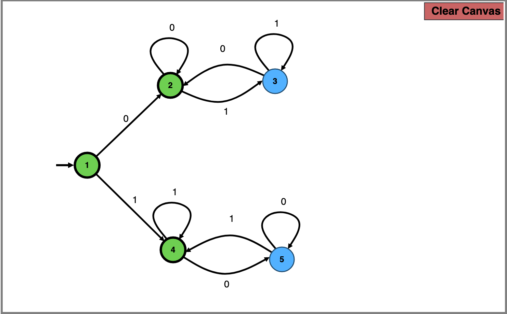

# Week 2 HW, distinction tasks

### Task 1)
The regex of such a substring would involve non-`0011` containing substrings at the start, end and between the `0011` substrings. So we could first attempt to find those

*NFA of a string that only accepts `0011`*

We use the above to find a DFA that does not accept 0011, which is as follows,

*substring with no `0011`*

And, by combining it, we can obtain the final epsilon-NFA

*NFA constructed as described at first*

The final minimized DFA obtained would be as follows

*Final DFA that contains even number of `0011`*

### Task 2)
We could notice that, if the number of occurences of `01` and `10` as substring in a string will be equivalent, if we start and end with the same symbol. This proof will be omitted for informality. However this will result in a DFA that is the same as C-2b, with the difference that the initial state is also an accepting state (since `epsilon` is now acceptable).

*DFA of D-2b*
