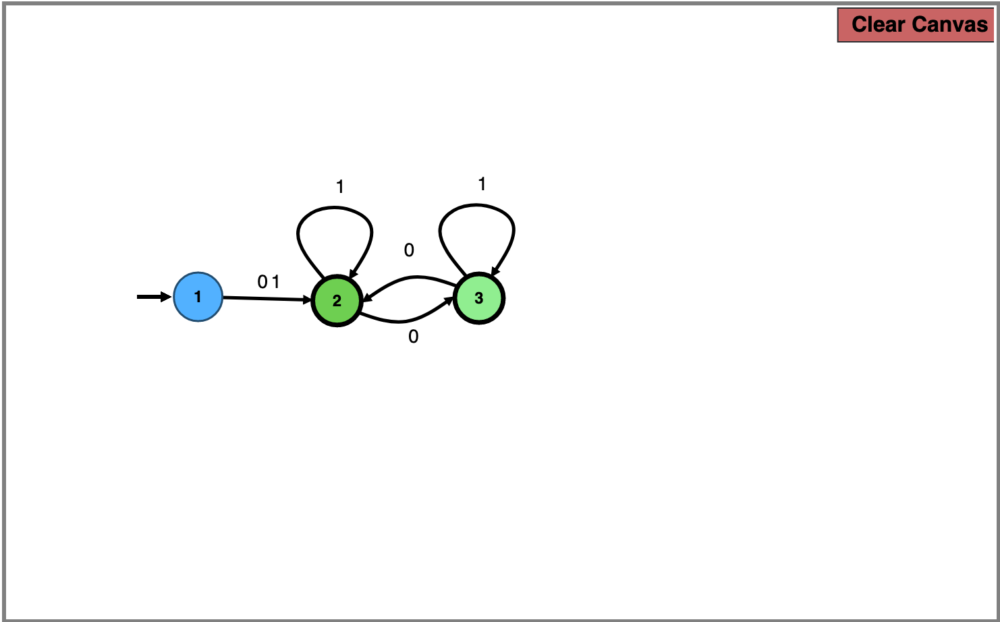
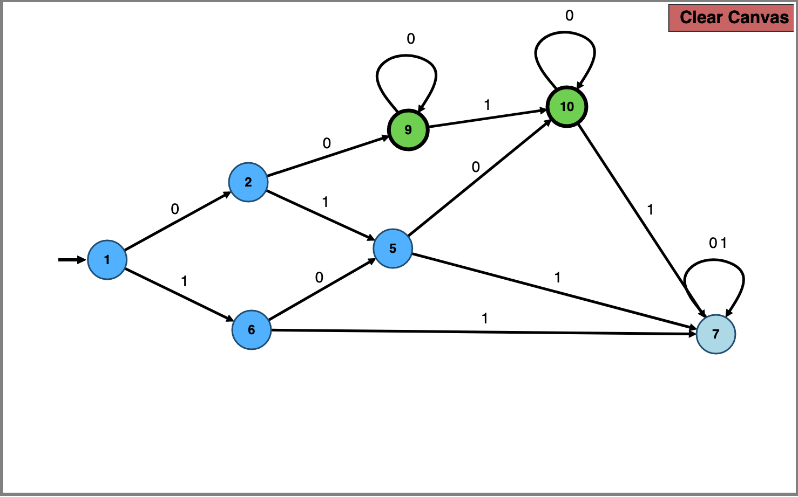
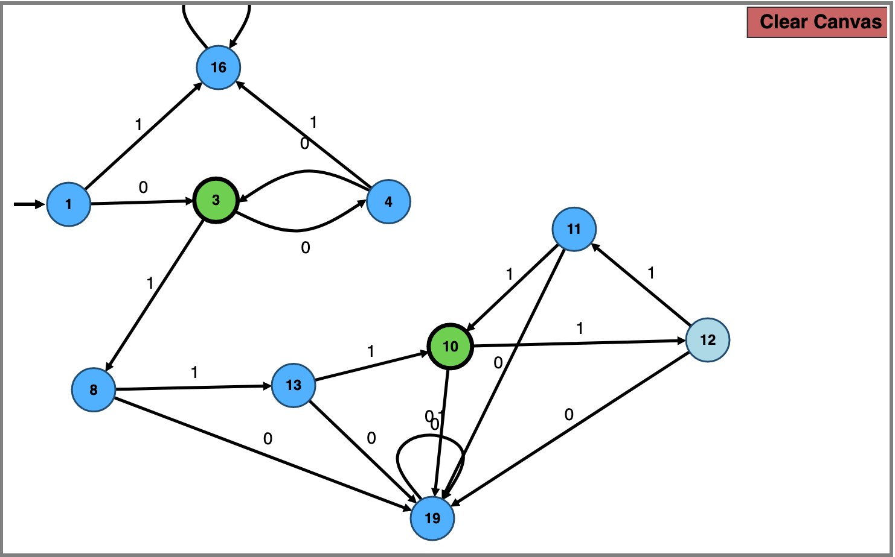
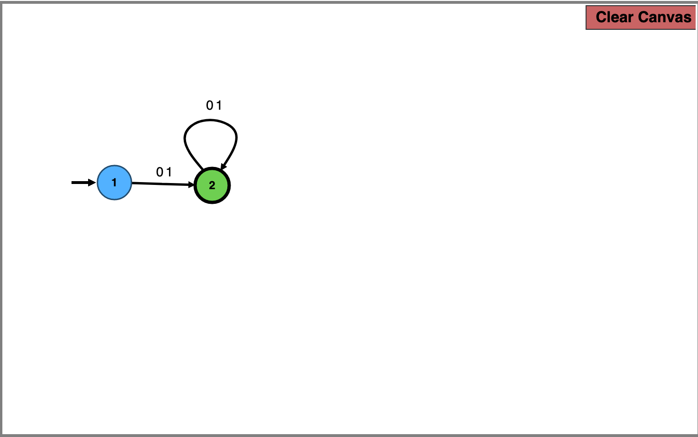
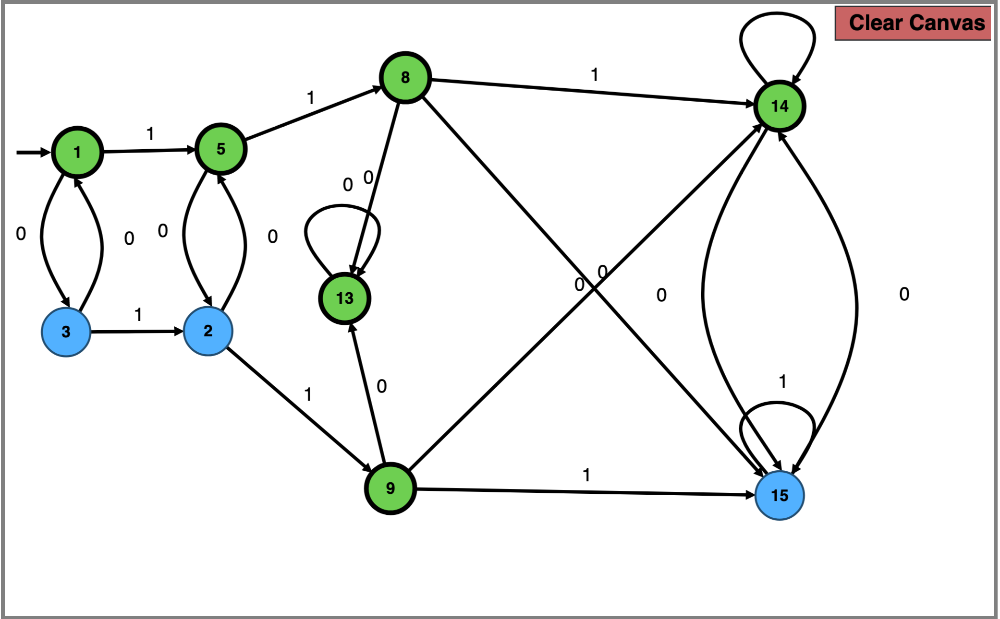
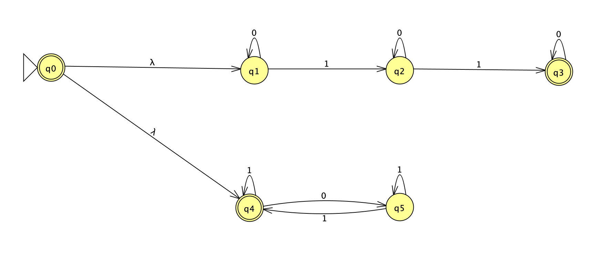
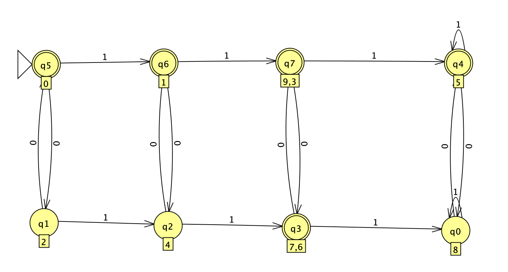
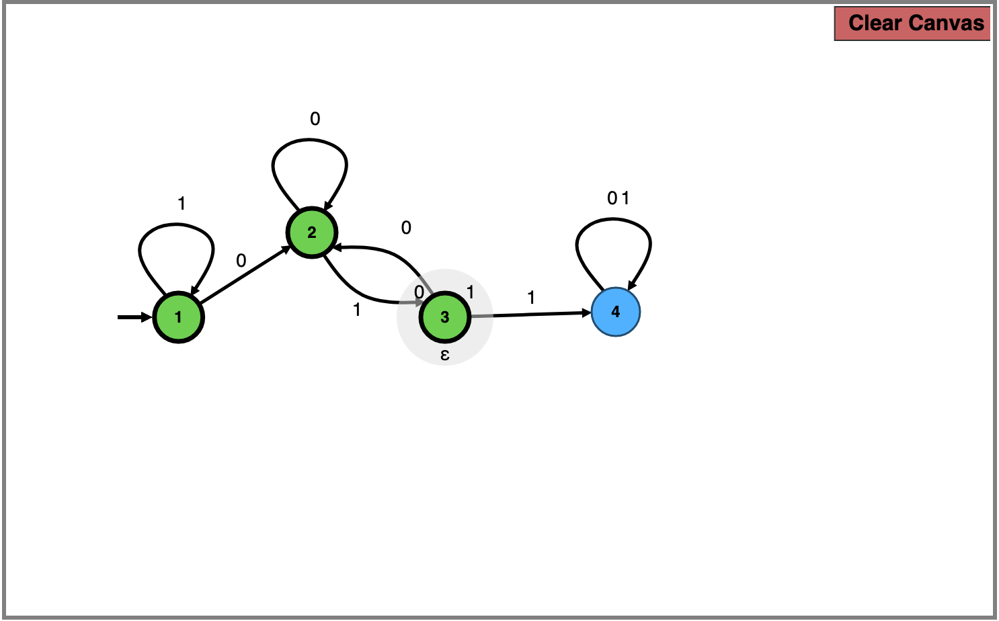

# Week 2 HW, pass tasks

### Task 1)
The two accepting rotating states are used to generate all of $L^*$. However since this language doesn't contain $\epsilon$, that aformentioned end state will be distinct from the start state.

### Task 2)
Using '1' as a delimiter, we can split it into 3 cases, no '0' before '1' (1.2), one '0' before '1' (1.5.7) and at least two '0's before one (1.5.9), including infinite '0's ('1' does not occur) (terminal 9).
The residue state will happen if we obtain more than one '1' (11)

### Task 3)
The top part of the DFA consists of finishing (3), resulted from an odd number of `0`s (since the prefix of string does not accept $\epsilon$). State (3, 4) forms a loop, whilst state (18) serves as a residual state.

The bottom part of the DFA consists of a loop of three `1`s, (10, 12, 11) that is connected to the top part via another length 3 `1` path. State (10) has to be different from state (3) as the postfix of the language has to be purely constsisted of `1`s. State (19) serves as the residual state for the bottom part, which could be merged with (18) but not for readability

### Task 4)
Since a DFA is also an NFA, I could use the same solution as a), except at the time of writing a) I didn't realize that I could do a DFA that is more simple to generate all of $L^*$

### Task 5)
This old NFA would be redrawn, as it is the foundation of my solution to `C-2a`.

*old NFA*

We would simply construct a union of two separate NFA,

*new epsilon-NFA, note that in JFLAP epsilon is replaced by lambda*

Using this intuition, the new DFA that is obtained will be as follows,

*minimal DFA of P-2e and C-2a*

The strategy here is to use the upper row of states as even parity of `0`s, the bottom row being odd parity of states. So it is easy to assign, according to condition

- All of top rows can be regarded as final states.
- The third state of bottom row (q3) is an accepting state for exactly two `1`s.

This is achieved as the number of `1`s in the sequence is the number of horizontal transitions taken from the initial state.

### Task 6)
This DFA is obtained by inverting a DFA that only accepts string which has substring `011`, by inverting all non-accepting states to accepting, and vice versa for accepting states.

