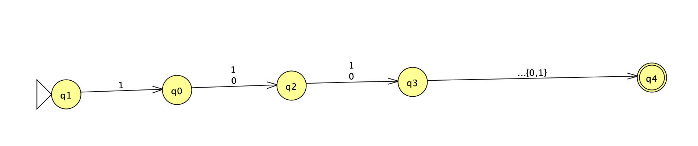

# Week 3 HW, distinction tasks

### a)
We can construct an NFA to accept this language trivially as follows,

The intuition comes from that all states after the occurence of n-th symbol has to be constant, hence implemented by the NFA. By counting, this results in an NFA with exactly $n + 1$ states that can describe $L_n$.

### b)
Recall Myhill-Nerode Theorem. For a regular language $L$, for all $i, j$, substring $u_i, u_j \in L$ is *indistinguishable* by $L$ iff, $$ \{u_i \cdot w_{ij}, \ u_j \cdot w_{ij}\} \subseteq L$$, where $w_{ij} \in \Sigma \notin L$. Vice versa, *distinguishable* if that $w_{ij}$ appended makes either $u_i$ or $u_j$ in $L$ but not both.

The number of equivalence classes of $L$ is the number of $(u_i, u_j)$ pairs that are *distinguishable* above, also the number of minimum states the accepting DFA of $L$ must hold.

Given that the regex for $L_n = \Sigma^*\cdot 1 \cdot \Sigma^{n - 1}$. Define $u_m := \Sigma^*\cdot 1 \cdot Sigma^{i - 1}$, since $w_{ij}$ cannot be in $L$. We can then, for $i \neq j$,

$$u_i \cdot w_{ij} = \Sigma^* \cdot 1 \cdot \Sigma^{n-1} \in L; $$
$$u_j \cdot w_{ij} = \Sigma^* \cdot 1 \cdot \Sigma^{n - i + j - 1} \notin L; $$
$$w_{ij} = \Sigma^{n - i}$$

For all $i, j \in \{1, 2, ..., n\}, i \neq j$. The number of $i,j$ pair at $i$ is equal to $C_i^n$ (abbreviation for n choose i).

Hence for all $i$ listed above, we have $C_1^n + C_2^n + ... + C_n^n = 2^n$, a combinatorial identity.

Hence the index of $L$ is $2^n$, meaning that the number of states of an L-accepting DFA cannot be less than $2^n$.

